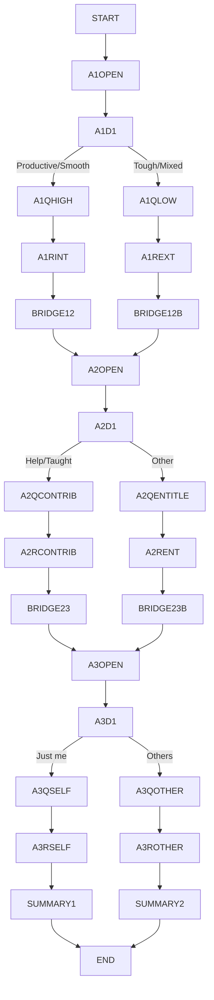

# Tree Diagram

```mermaid
graph TD
    START --> A1OPEN
    A1OPEN --> A1D1
    A1D1 -->|Productive/Smooth| A1QHIGH
    A1D1 -->|Tough/Mixed| A1QLOW
    A1QHIGH --> A1RINT --> BRIDGE12 --> A2OPEN
    A1QLOW --> A1REXT --> BRIDGE12B --> A2OPEN
    A2OPEN --> A2D1
    A2D1 -->|Help/Taught| A2QCONTRIB --> A2RCONTRIB --> BRIDGE23 --> A3OPEN
    A2D1 -->|Other| A2QENTITLE --> A2RENT --> BRIDGE23B --> A3OPEN
    A3OPEN --> A3D1
    A3D1 -->|Just me| A3QSELF --> A3RSELF --> SUMMARY1 --> END
    A3D1 -->|Others| A3QOTHER --> A3ROTHER --> SUMMARY2 --> END
```
