# Daily Reflection Tree — Visual Diagram

```mermaid
flowchart TD
    START([START\nOpening]) --> A0_OPEN

    A0_OPEN{"A0: How did\ntoday feel?"}
    A0_OPEN -->|moved through it / mostly held wheel| A1_Q_INT
    A0_OPEN -->|moved through me / wheel held me| A1_Q_EXT

    subgraph AXIS1["⚡ AXIS 1 — Locus: Victim vs Victor"]
        A1_Q_INT{"A1-INT: Moment\nthat went well —\nyour role?"}
        A1_Q_EXT{"A1-EXT: Moment\nthat went wrong —\nfirst thought?"}

        A1_Q_INT -->|prepared / adjusted / kept energy| A1_R_STRONG_INT
        A1_Q_INT -->|might have just worked out| A1_R_LUCK
        A1_Q_EXT -->|something I could have done differently| A1_R_RECOVERING
        A1_Q_EXT -->|others / circumstances / tangled| A1_R_EXT

        A1_R_STRONG_INT(["✦ 'You were in it.\nThat's not nothing.'"])
        A1_R_LUCK(["✦ 'Luck doesn't\nexplain patterns.'"])
        A1_R_RECOVERING(["✦ 'Most people's first\nmove is outside.\nYours wasn't.'"])
        A1_R_EXT(["✦ 'Even choosing\nto wait is a choice.'"])
    end

    A1_R_STRONG_INT --> BRIDGE_1_2
    A1_R_LUCK --> BRIDGE_1_2
    A1_R_RECOVERING --> BRIDGE_1_2
    A1_R_EXT --> BRIDGE_1_2

    BRIDGE_1_2[/"→ From how you moved — to what you gave"/]
    BRIDGE_1_2 --> A2_OPEN

    subgraph AXIS2["🤝 AXIS 2 — Orientation: Contribution vs Entitlement"]
        A2_OPEN{"A2: Shape of your\ninteraction today?"}
        A2_OPEN -->|gave / giving but keeping score| A2_Q_GAVE
        A2_OPEN -->|needed something / somewhere else mentally| A2_Q_NEEDED

        A2_Q_GAVE{"A2-G: What was\nunderneath the\ngiving?"}
        A2_Q_NEEDED{"A2-N: Did you\nget what\nyou needed?"}

        A2_Q_GAVE -->|needed it / right thing even if costly| A2_R_PURE
        A2_Q_GAVE -->|wanted to be seen / automatic| A2_R_MIXED
        A2_Q_NEEDED -->|no / partially / yes but hard| A2_R_ENTITLED_HONEST
        A2_Q_NEEDED -->|pulled back effort| A2_R_ENTITLED_WITHDREW

        A2_R_PURE(["✦ 'The load-bearing\nwork of teams.'"])
        A2_R_MIXED(["✦ 'Mixed motive,\nright order.'"])
        A2_R_ENTITLED_HONEST(["✦ 'You kept going.\nThat costs something.'"])
        A2_R_ENTITLED_WITHDREW(["✦ 'The withdrawal costs\nyou more than them.'"])
    end

    A2_R_PURE --> BRIDGE_2_3
    A2_R_MIXED --> BRIDGE_2_3
    A2_R_ENTITLED_HONEST --> BRIDGE_2_3
    A2_R_ENTITLED_WITHDREW --> BRIDGE_2_3

    BRIDGE_2_3[/"→ From what you gave — to who was in your mind"/]
    BRIDGE_2_3 --> A3_OPEN

    subgraph AXIS3["🌍 AXIS 3 — Radius: Self-Centric vs Altrocentric"]
        A3_OPEN{"A3: When hardest —\nwhere did\nyour mind go?"}
        A3_OPEN -->|to me| A3_Q_SELF
        A3_OPEN -->|team / colleague / bigger picture| A3_Q_OTHER

        A3_Q_SELF{"A3-S: Did anyone\nnotice you\nstruggling?"}
        A3_Q_OTHER{"A3-O: Did that\nawareness change\nwhat you did?"}

        A3_Q_SELF -->|tried to protect others| A3_R_PROTECTIVE
        A3_Q_SELF -->|alone / unacknowledged / not thought| A3_R_SELF
        A3_Q_OTHER -->|changed actions / made things easier| A3_R_TRANSCENDENT
        A3_Q_OTHER -->|changed feelings only / harder| A3_R_AWARE

        A3_R_PROTECTIVE(["✦ 'Quiet care.\nAre you protecting\nor hiding?'"])
        A3_R_SELF(["✦ 'Self-containment\ncan narrow\nthe frame.'"])
        A3_R_TRANSCENDENT(["✦ 'Between noticing\nand doing:\nthat's character.'"])
        A3_R_AWARE(["✦ 'Both responses\nto actually\ncaring.'"])
    end

    A3_R_PROTECTIVE --> SUMMARY
    A3_R_SELF --> SUMMARY
    A3_R_TRANSCENDENT --> SUMMARY
    A3_R_AWARE --> SUMMARY

    SUMMARY["SUMMARY\nInterpolated from\nanswers + signals"]
    SUMMARY --> END([END\nSee you tomorrow.])
```

## Node inventory

| Type | Count | Minimum required |
|------|-------|-----------------|
| start | 1 | 1 |
| question | 9 | 8 |
| decision | 9 | 4 |
| reflection | 12 | 4 |
| bridge | 2 | 2 |
| summary | 1 | 1 |
| end | 1 | 1 |
| **Total** | **35** | **25** |

## Possible paths: 16

Every path visits exactly 20 nodes.
